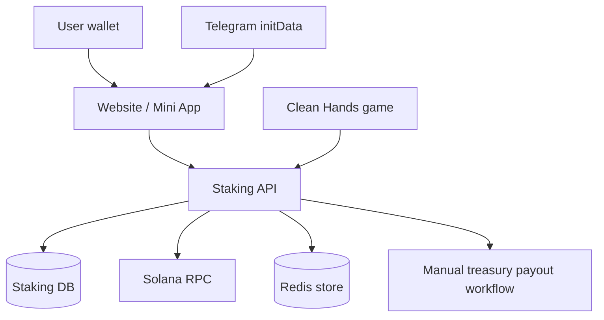

# CLEAN Hands App Mechanics

Updated: 2026-06-25  
Primary app: https://app.cleanhands.fun  
Token: `$CLEAN` on Solana

This document explains how the CLEAN Hands Mini App works as a product and as a
backend system. It is written for operators, developers, community moderators,
and reviewers who need one source of truth for staking, boosters, game rewards,
claiming, and safety controls.

> Short version: CLEAN is a non-custodial soft-staking app. Users prove wallet
> ownership, enroll the `$CLEAN` they already hold, and rewards accrue from a
> server-side economics engine. Tokens never leave the user's wallet when they
> stake. Reward claims are manual treasury payout requests.

---

## 1. Product surfaces

| Surface | Role | Source |
|---|---|---|
| Landing site | Public website and brand entry | `clean-hands/deploy/` |
| Telegram Mini App | Main user app: connect, stake, boost, claim, play | `clean-hands/staking-api/webapp/` |
| Staking API | Shared source of truth for site and Mini App | `clean-hands/staking-api/app.py` |
| Economics engine | Pure reward formula and booster rules | `clean-hands/staking-api/economics.py` |
| SQLite/Postgres store | Users, rewards, claims, game verification, socials | `clean-hands/staking-api/db.py` |
| Ops/admin tools | Claims, flags, game/social review, reconciliation | `clean-hands/staking-api/*.py` |

The key design choice is that the website and Mini App do not each invent their
own staking numbers. They ask the same API for profile state and public economic
rules. That keeps the numbers consistent across every user surface.



---

## 2. Trust model

CLEAN uses a server-side reward ledger, but it does not custody user staking
tokens.

- **Wallet ownership** is proven by signing a one-time login message.
- **Soft staking** records how much `$CLEAN` the wallet wants to enroll.
- **Effective stake** is capped by the wallet's live on-chain `$CLEAN` balance.
- **Burns and MM deposits** are credited only after on-chain verification.
- **Escape game boosts** are paid only from server-verified game progress.
- **Social activation** is paid only from server-side verification rows.
- **Claims** create payout requests; the treasury/operator pays manually.
- **No server private key** is required for normal staking, boosting, or claims.

The core anti-gaming rule is:

```text
effective_staked = min(recorded_staked, current_on_chain_clean_balance)
```

If a user stakes and then sells or moves tokens out, rewards drop to what the
wallet still actually holds.

---

## 3. Login and identity

### Wallet login

1. Client asks `GET /api/nonce?wallet=<pubkey>`.
2. API returns a one-time nonce and login message.
3. User signs the message with the Solana wallet.
4. Client posts `POST /api/login`.
5. API verifies the signature and creates a session token.

The session token is used in request bodies for write/read profile endpoints.

### Telegram binding

Inside the Telegram Mini App, the client can also send Telegram `initData`.
The server verifies Telegram's HMAC and binds:

```text
telegram_id <-> wallet
```

This matters because game saves and some social verification logic depend on a
Telegram-bound player identity.

### Referral attribution

On first login, the API can accept a referral code or wallet. A referral counts
for reward purposes only while the referred wallet is actively staking above the
configured minimum.

---

## 4. Soft staking lifecycle

### Stake

Endpoint: `POST /api/stake`

What happens:

1. User session is verified.
2. API force-refreshes the live `$CLEAN` balance from Solana RPC.
3. User enrolls a percent of the wallet balance.
4. The DB stores `recorded_staked`.
5. Reward accrual starts or continues.

No tokens move. No approval is granted to the app. This is a snapshot/enrollment
model.

### Unstake

Endpoint: `POST /api/unstake`

Unstaking:

- sets recorded stake to zero;
- resets the continuous staking clock;
- forfeits pending rewards;
- keeps permanent burn history.

This is intentionally strict: pending rewards vest only while the user keeps the
wallet in the wash.

### Profile

Endpoint: `POST /api/profile`

Returns live profile state:

- wallet, Telegram id, username;
- live balance and staked amounts;
- effective stake;
- pending rewards and claimed total;
- active referral count;
- claim lock status;
- social activation status;
- APR breakdown.

---

## 5. Reward formula

The economics engine is in `staking-api/economics.py`.

```text
effective_apr =
  BASE_APR * (
    1
    + amount_boost
    + loyalty_boost
    + referral_boost
    + liquidity_boost
    + wallet_balance_boost
    + escape_boost
    + vip_boost
  )
  + burn_bonus_apr
```

```text
reward(dt) = effective_staked * effective_apr * dt / one_year
```

Current defaults:

| Item | Default |
|---|---:|
| Base APR | 40% |
| Claim lock | 90 continuous staking days |
| Payout setup window | 3 days before unlock |
| Claim fee | $5 worth of `$CLEAN`, deducted from payout |
| Token decimals | 6 |

All token money amounts are stored in integer base units in the DB. Human token
amounts are produced only at the API boundary.

---

## 6. Booster stack

Boosters are additive multiplier components, except burn, which is a flat APR
bonus added after the multiplier.

| Booster | How it activates | Default value / cap | Verified by |
|---|---|---:|---|
| Holdings | Enroll enough `$CLEAN` | +0.10 / +0.25 / +0.50 | Live wallet balance |
| Loyalty | Stay continuously staked | +0.05 per 30 days, cap +0.50 | DB staking clock |
| Referrals | Referred wallets actively stake | +0.02 each, cap +0.30 | DB + effective stake |
| Wallet balance | Hold qualifying SOL, optional CLEAN | +0.10 to +0.50 | Cached Solana balances/prices |
| MM liquidity | Deposit SOL plus optional CLEAN to reserve | up to +0.70 | On-chain transfer verification |
| Escape game | Reach verified Escape milestones | +0.20 / +0.33 / +0.50 / +1.00 | Server-side game ledger |
| Social gate | Verify TG/X/Discord | scales Escape boost 0/3 to 3/3 | Social verification ledger |
| VIP | Qualifying MM deposit | tops total multiplier to 3x | MM deposit flag |
| Burn | Burn `$CLEAN` permanently | +0.05 APR per 100k, cap +2.00 APR | On-chain burn tx |

### Holdings tiers

Highest matching tier wins:

| Enrolled `$CLEAN` | Amount boost |
|---:|---:|
| 100,000+ | +0.10 |
| 1,000,000+ | +0.25 |
| 10,000,000+ | +0.50 |

### Loyalty

The loyalty clock counts full 30-day periods of continuous staking:

```text
loyalty_boost = min(0.50, full_30_day_periods * 0.05)
```

Unstaking resets the clock and forfeits pending rewards.

### Referrals

Referral boost counts active staking referrals only:

```text
referral_boost = min(0.30, active_referrals * 0.02)
```

Idle invites do not count.

### Wallet balance booster

The wallet balance booster requires SOL. CLEAN can add qualifying value, but
CLEAN-only does not qualify.

Default rule:

- SOL value must be at least $50.
- CLEAN value counts only when it is also at least $50.
- qualifying value is capped at $500.
- boost scales from +0.10 to +0.50 across the band.

### Market-maker liquidity

MM liquidity is a real-money booster. The wallet sends SOL plus optional CLEAN to
the configured reserve wallet. The server verifies the transaction and credits a
USD-sized deposit, capped at the configured maximum.

Defaults:

- minimum SOL leg: $50;
- maximum credited value: $500;
- liquidity boost cap: +0.70;
- qualifying MM deposit also marks the wallet VIP.

### VIP

VIP does not simply add a fixed number. It tops the total multiplier up to the
configured VIP multiplier, default 3x, when the wallet has a qualifying MM
deposit.

---

## 7. Escape game booster and social activation

The Clean Hands game can increase staking power through Escape milestones.

Escape tiers:

| Verified Escape score | Escape boost before social gate |
|---:|---:|
| x5 | +0.20 |
| x10 | +0.33 |
| x20 | +0.50 |
| x33 | +1.00 |

The score is not trusted directly from the client save file. The server keeps a
separate `game_verification` ledger and uses time/heartbeat/risk checks before
promoting raw game progress into verified progress.

### Anti-cheat design

The game can save raw progress, but raw saves do not pay rewards by themselves.
The staking path reads only:

```text
game_verification.verified_escape_score
```

Risk states include:

- `unverified`;
- `verifying`;
- `verified`;
- `review`;
- `blocked`.

Operators can pause all Escape payout impact with `halt_escape_boost`.

### Social activation gate

Escape reward is then scaled by verified socials:

| Verified socials | Paid share of Escape boost |
|---:|---:|
| 0 of 3 | 0% |
| 1 of 3 | 33.33% |
| 2 of 3 | 66.66% |
| 3 of 3 | 100% |

Platforms:

- Telegram (`tg`);
- X (`x`);
- Discord (`discord`).

Telegram can be verified automatically from signed Telegram `initData`. X and
Discord user submissions enter `pending` and require admin/server verification.
This prevents a client script from self-activating social rewards.

Important money rule: when social status changes, the API settles rewards under
the old gate first. That means a user cannot retroactively boost past accrual
windows by verifying socials later.

---

## 8. Burn-to-boost

Endpoint: `POST /api/burn`

Burn is permanent and on-chain verified.

Flow:

1. User burns `$CLEAN` from their own wallet.
2. Client submits the burn transaction signature.
3. API reads the finalized transaction from Solana RPC.
4. API verifies:
   - correct mint;
   - finalized transaction;
   - signed-in wallet was the burn authority;
   - signature was not already credited.
5. `total_burned` increases.

Default burn bonus:

```text
burn_bonus_apr = min(2.00, total_burned / 100,000 * 0.05)
```

Example: burning 200,000 `$CLEAN` adds +0.10 flat APR.

---

## 9. Claims and payout workflow

Endpoint: `POST /api/claim`

Claims are manual treasury payout requests, not automatic server-signed token
transfers.

Claim gate:

1. User must be staked continuously for the configured lock period.
2. If payout setup is enabled, payout wallet must be confirmed.
3. API force-refreshes live wallet balance.
4. API accrues rewards up to the current time.
5. API deducts the configured fee in `$CLEAN`.
6. API atomically moves pending accrued rewards into a `claims` row.
7. Operator pays the treasury transaction.
8. Operator marks the claim paid only after transfer verification.

Payout wallet changes require a fresh wallet signature over the exact
destination. A stolen session token cannot silently redirect rewards.

Admin endpoints:

- `POST /api/admin/pending`;
- `POST /api/admin/mark_paid`;
- `POST /api/admin/flags`;
- `POST /api/admin/set_flag`.

---

## 10. Data model overview

Main tables:

| Table | Purpose |
|---|---|
| `stakers` | wallet profile, stake, balance cache, accrual, claim totals |
| `ledger` | append-only audit trail for stake/unstake/claim/burn/fees |
| `claims` | payout request state machine |
| `burns` | idempotent burn signature credits |
| `mm_deposits` | idempotent MM deposit credits |
| `notifs` | notification dedupe |
| `ops_flags` | operator kill switches |
| `wallet_links` | multi-wallet portfolio links |
| `game_state` | raw game cloud save and leaderboard score |
| `game_verification` | server-side Escape reward ledger |
| `game_verify_events` | hidden Escape risk/review trail |
| `social_verifications` | TG/X/Discord reward activation ledger |
| `social_verify_events` | social verification audit trail |
| `bridge_orders` | No Stains Bridge/EasyBit order log |

Schema version at the time of this document: `12`.

---

## 11. Operator safety controls

Known ops flags:

- `halt_all`;
- `halt_staking`;
- `halt_claims`;
- `halt_burns`;
- `halt_payout_setup`;
- `halt_mm`;
- `halt_bridge`;
- `halt_escape_boost`.

These flags fail closed. For example, `halt_claims` blocks claim creation but
does not take the read-only app offline.

Readiness endpoint:

```text
GET /readyz
```

Checks DB, Redis store, config, Solana RPC readiness, ops flags, and pending
claim age.

---

## 12. Public economics endpoint

Endpoint:

```text
GET /api/economics
```

The app uses this to render the same rules that the backend enforces. It exposes
public, non-secret config such as:

- base APR;
- amount tiers;
- loyalty/referral caps;
- Escape tiers;
- social gate metadata;
- burn caps;
- claim lock/fee;
- bridge and MM public config;
- mint and decimals.

Never expose private RPC keys, admin tokens, or server secrets here.

---

## 13. Current live claim to users

Use this wording when explaining the mechanism:

> Connect your Solana wallet, soft-stake the `$CLEAN` you already hold, and build
> your booster stack. Tokens never leave your wallet when staking. Rewards vest
> after the continuous staking window and are requested as manual treasury
> payouts. Game and social boosts are server-verified so scripts cannot fake
> payout power.

Avoid saying:

- guaranteed profit;
- risk-free yield;
- automated payout;
- custodial vault;
- on-chain staking contract.

The current system is a server-side loyalty/reward ledger with wallet proofs,
on-chain verification for money actions, and manual treasury settlement.

