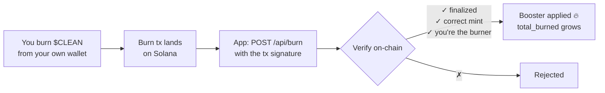

# 🧼 CLEAN — Boosters & Burn

> **Clean hands. Dirty money.** Wash your bags, burn to boost, stay spotless. ✦
> The friendly guide to how your **APR booster** works — for users *and* the dev plugging it in.

CLEAN is **soft-staking**: your $CLEAN **never leaves your wallet**. You enrol a balance, it earns APR, and you make that APR bigger with **boosters**. This page is the single source of truth for what every booster does, how the **burn** mechanic works, and how to wire it.

---

## ⚡ TL;DR — every way to boost

| Booster | What you do | Effect on APR | Status |
|---|---|---|---|
| 🪣 **Holdings** | Stake more $CLEAN | up to **+0.50×** | ✅ Live |
| ⏳ **Loyalty** | Keep staking, uninterrupted | up to **+0.50×** | ✅ Live |
| 🤝 **Referrals** | Invite people who then **stake** | up to **+0.30×** | ✅ Live |
| 💧 **Liquidity** | Add **$CLEAN + SOL** to the pool | up to **+0.70×** | 🔧 Being wired |
| 🔥 **Burn** | Permanently burn $CLEAN | **+ bonus APR** (up to **+200%**) | ✅ Live |

Stack the first four and your multiplier climbs from **1× → up to 3×**. 🔥 **Burn** then adds *flat bonus APR on top* — and it's **permanent**.

```
Your APR  =  40% base  ×  ( 1 + booster stack )  +  burn bonus
                                  └─ up to +2.00 ─┘     └ up to +200% ┘
                                  (→ up to a 3× multiplier)
```

> ⚠️ One booster per wallet, one honest way to earn it — boosters are tied to **real on-chain actions you take with your own wallet**. No sybil farming, no self-trading. That's the whole point of CLEAN.

---

## 🚀 How to use it (60 seconds)

1. **Connect** your Solana wallet at **[app.cleanhands.fun](https://app.cleanhands.fun)** (Phantom, Solflare, WalletConnect, or in-Telegram).
2. **Stake** — pick a % of your $CLEAN. It stays in your wallet; you're just enrolling it. APR starts immediately.
3. **Boost** — 🔥 burn, 💧 add liquidity, 🤝 share your referral code. Watch your APR climb.
4. **Claim** after the vesting window (default **90 days** of continuous staking).

That's it. No lockups, no custody, no approvals that can drain you.

---

## 🧮 The booster math (it's just addition)

Every booster is a **tier that adds to your stack** — they don't multiply each other, they **add up**. Predictable, bounded, no surprises.

```
effective_apr = BASE_APR × (1 + holdings + loyalty + referrals + liquidity) + burn_bonus
```

| Term | Default | Cap |
|---|---|---|
| `BASE_APR` | 40% | — |
| `holdings` | tiered (see below) | +0.50 |
| `loyalty` | +0.05 / 30 days | +0.50 |
| `referrals` | +0.02 / active referral | +0.30 |
| `liquidity` | configurable | +0.70 |
| `burn_bonus` | +0.05 APR / 100k burned | +2.00 (i.e. +200% APR) |

### Worked example
> 1,000,000 $CLEAN staked · 60 days in · 3 friends staking · 200k burned

```
holdings  = +0.25   (≥ 1,000,000 tier)
loyalty   = +0.10   (2 × 30-day periods)
referrals = +0.06   (3 × 0.02)
burn_bonus= +0.10   (200,000 / 100,000 × 0.05)

effective = 0.40 × (1 + 0.25 + 0.10 + 0.06) + 0.10
          = 0.40 × 1.41 + 0.10
          = 66.4% APR  ✦
```

Rewards then accrue continuously: `reward = staked_effective × APR × (time / 1 year)`.

> 🛡️ **Anti-gaming:** you only ever earn on what you **still hold** — `staked_effective = min(staked, current on-chain balance)`. Stake then sell, and the booster has nothing to stand on.

---

## 🪣 Holdings tier *(Live)*
The more you stake, the higher the tier. **Highest matching tier wins** (not summed):

| Stake ≥ | Adds |
|---|---|
| 10,000,000 | +0.50 |
| 1,000,000 | +0.25 |
| 100,000 | +0.10 |

## ⏳ Loyalty *(Live)*
**+0.05 for every full 30 days** of continuous staking, capped at **+0.50** (≈ 10 months to max). The clock survives re-staking but **resets if you unstake**.

## 🤝 Referrals & coupons *(Live)*
Share your **referral code** (`ref_code` in your profile). You earn **+0.02 per referral**, capped at **+0.30** — but **only while that friend is actively staking**.

> 🎟️ **The coupon rule:** a referral code only *activates* once the invited wallet **stakes**. Idle invites don't count, and stop counting if the friend unstakes. Real participation only.

## 💧 Liquidity booster *(being wired by your dev)*
Add **$CLEAN + SOL** to the liquidity pool and earn up to **+0.70×** — the tier that takes you to a **3× multiplier**.

This is genuine **liquidity provision**: your position sits in the pool, automatically selling into buys and buying into sells, earning swap fees and taking real impermanent-loss risk. The booster rewards you for the depth you provide.

**How it's verified** (same pattern as burn): your wallet's LP position in the canonical pool is checked **on-chain**; meet the threshold → the booster applies. **One activation per wallet** (anti-sybil). See [Developer integration](#-developer-integration) for the hook.

---

## 🔥 The Burn mechanic *(Live)*

Burning permanently removes $CLEAN from supply — and CLEAN pays you for it with **permanent bonus APR**.

### What you get
- **+0.05 APR per 100,000 $CLEAN burned**, up to **+200% APR**.
- It's a **flat bonus added on top** of your multiplier (not capped by the 3× stack).
- It's **permanent** — it survives unstaking and never decays. Burn once, boosted forever.

### How a burn works


Step by step:
1. **You** burn $CLEAN from **your own** wallet (your dev's infra builds the burn transaction; you approve it in your wallet).
2. The app calls **`POST /api/burn`** with the **transaction signature**.
3. The server **verifies on-chain** that:
   - the tx is **finalized**,
   - it burned the **correct $CLEAN mint**, and
   - **you** (the signed-in wallet) are the burning authority.
4. The bonus is credited and your `total_burned` grows.

### Built-in safety
- 🔒 **Idempotent** — each burn signature can be credited **exactly once** (DB primary key). Replays do nothing.
- 🔗 **On-chain truth** — the server never trusts the client's claimed amount; it reads the finalized transaction.
- 🧤 **Non-custodial** — the server never holds your keys. You sign your own burn.

---

## 💸 Claiming rewards

| Rule | Default | Env |
|---|---|---|
| **Vesting** — claimable only after N days of *continuous* staking | **90 days** | `STAKE_CLAIM_LOCK_DAYS` |
| **Claim fee** — charged in $CLEAN at live price, deducted from payout | **$5** | `STAKE_CLAIM_FEE_USD` |
| **Payout setup window** — confirm your payout wallet before unlock | **3 days** prior | `STAKE_PAYOUT_SETUP_DAYS` |

- **Unstaking resets** your stake, your loyalty clock, **and forfeits pending rewards** — pending only vests while you stay staked. (Your **burn** bonus is permanent and survives.)
- Payouts are **manual & non-custodial**: a claim is recorded as `requested`; an operator pays it from the treasury and marks it `paid` with the tx. **No private key ever lives on the server.**

---

## ⚙️ Config reference *(the dev tuning panel)*

All boosters are env-tunable — restart to apply. Defaults below match the code.

```bash
# Base
STAKE_BASE_APR=0.40            # 40% base APR
DEFAULT_TOKEN_MINT=<your $CLEAN mint>
DEFAULT_TOKEN_DECIMALS=6

# Loyalty   (economics.py)
STAKE_LOYALTY_PER_30D=0.05
STAKE_LOYALTY_CAP=0.50

# Referrals (economics.py)
STAKE_REFERRAL_PER=0.02
STAKE_REFERRAL_CAP=0.30

# Burn      (economics.py)
STAKE_BURN_UNIT=100000         # tokens per bonus step
STAKE_BURN_APR_PER_UNIT=0.05   # +5% APR per step
STAKE_BURN_CAP_APR=2.00        # max +200% APR

# Claiming  (app.py)
STAKE_CLAIM_LOCK_DAYS=90
STAKE_CLAIM_FEE_USD=5
STAKE_PAYOUT_SETUP_DAYS=3
STAKE_BALANCE_TTL=300          # on-chain balance re-check interval (s)

# Auth / login
STAKE_LOGIN_DOMAIN=cleanhands.fun
```

> **Holdings tiers** are defined in `economics.py → AMOUNT_TIERS` (highest match wins).
> **Liquidity booster** is added the same way — wire its cap as a new additive tier (target **+0.70** to make the stack top out at **3×**).

---

## 🔌 Developer integration

The whole booster system rides on a tiny, signature-based API. Auth is a **Solana wallet signature** → short-lived session token; every booster action is verified **on-chain**.

### Login (once)
```http
GET  /api/nonce?wallet=<pubkey>      → { nonce, message }   # sign `message` with the wallet
POST /api/login  { wallet, signature, nonce }  → { token }  # token used below
```

### Read state
```http
POST /api/profile  { token }
→ { staked, staked_effective, pending_rewards, total_burned,
    active_referrals, apr: { base, amount_boost, loyalty_boost,
    referral_boost, burn_bonus_apr, effective_apr, effective_apr_pct }, ... }
```

### 🔥 Burn → boost
```http
POST /api/burn  { token, signature }   # signature = the on-chain burn tx
→ { burned, profile }                  # idempotent; verified finalized/mint/authority
```
**Your infra builds & sends the burn tx; the user signs it.** Then hand the signature to `/api/burn` and the server does the rest. (See `staking-api/solana.py → verify_burn`.)

### 💧 Liquidity → boost *(the hook to plug)*
Mirror the burn pattern:
1. Your MM/LP infra adds the user's **$CLEAN + SOL** to the pool and returns a position reference.
2. Add a server check that verifies the wallet's **LP position on-chain** (canonical pool + threshold), grants the additive `liquidity` boost, and records **one activation per wallet** (the same idempotency guard burns use — keyed by wallet/position).
3. Expose the cap via env and add it to the additive sum in `economics.py → effective_apr`.

> Everything else — accrual, stacking, caps, claim gating — already flows through `effective_apr`, so a new additive tier is a one-line addition plus its on-chain check.

---

## ❓ FAQ

**Do my tokens leave my wallet to stake?** No. Soft-staking is non-custodial — you enrol a balance, it never moves. Burns and LP deposits are real on-chain actions **you** sign.

**Is the burn bonus really permanent?** Yes. `total_burned` only grows; the bonus survives unstaking and never decays.

**Can I farm boosters with lots of wallets?** No — each booster is tied to a real on-chain action by your own wallet, activations are one-per-wallet, and you only earn on tokens you still hold. Sybil farming is designed out.

**What if I unstake?** Stake, loyalty clock, and **pending rewards reset**. Your **burn bonus stays**. Re-staking starts a fresh loyalty clock.

**Why a claim fee / vesting lock?** Vesting rewards real long-term stakers; the small $-denominated fee covers payout costs and is deducted from the claim (no extra transaction).

---

*A meme. Not financial advice. $CLEAN is a community token on Solana — stay spotless. ✦*
